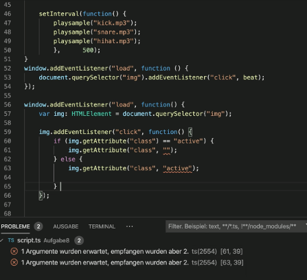

## **08 _#_** Programmiergrundlagen III

### Lektionseinführung
<video controls width="100%"> 
    <source src="https://lehre.gabriel-rausch.de/HFU/EIA1_SoSe20/L08/L08_01_Einfuehrung.mp4" type="video/mp4"> 
    <a href="https://lehre.gabriel-rausch.de/HFU/EIA1_SoSe20/L08/L08_01_Einfuehrung.mp4">Zum Video</a>
</video>

### Bedingungen
<video controls width="100%"> 
    <source src="https://lehre.gabriel-rausch.de/HFU/EIA1_SoSe20/L08/L08_02_Bedingungen.mp4" type="video/mp4"> 
    <a href="https://lehre.gabriel-rausch.de/HFU/EIA1_SoSe20/L08/L08_02_Bedingungen.mp4">Zum Video</a>
</video>

Mit Bedingungen sollen Regeln für den Code festgelegt werden. Je nach Bedingung kann dann unterschiedlicher Code ausgeführt werden. Dabei kann eine Bedingung nur erfüllt oder nicht erfüllt werden, also wahr oder falsch sein. Eine bedingte Anweisung kann man mit einer If-Anweisung formulieren:  
```typescript
if (Bedingung) {  
    // Codeblock, der bei wahrer Bedingung ausgeführt werden soll;  
}
```
Zum Formulieren von Bedingungen werden oft Vergleichsoperatoren verwendet...

### Vergleichsoperatoren
<video controls width="100%"> 
    <source src="https://lehre.gabriel-rausch.de/HFU/EIA1_SoSe20/L08/L08_03_Vergleichsoperatoren.mp4" type="video/mp4"> 
    <a href="https://lehre.gabriel-rausch.de/HFU/EIA1_SoSe20/L08/L08_03_Vergleichsoperatoren.mp4">Zum Video</a>
</video>

Um Werte miteinander vergleichen zu können werden die verschiedenen Vergleichsoperatoren genutzt. Eine Übersicht der Vergleichsoperatoren mit ihrer Funktionsweise finden Sie auch nochmal [hier](https://www.w3schools.com/js/js_comparisons.asp) auf W3Schools.  

### Logische Operatoren
<video controls width="100%"> 
    <source src="https://lehre.gabriel-rausch.de/HFU/EIA1_SoSe20/L08/L08_04_Logische_Operatoren.mp4" type="video/mp4"> 
    <a href="https://lehre.gabriel-rausch.de/HFU/EIA1_SoSe20/L08/L08_04_Logische_Operatoren.mp4">Zum Video</a>
</video>

Bedingungen können auch miteinander Verkettet werden - dafür werden logische Operatoren eingesetzt. Bei `&&` UND müssen beide verkettete Bedingungen wahr sein, damit die Aussage wahr ist. Bei `||` ODER reicht es, dass eine der beiden Bedingungen wahr ist, damit die Aussage wahr ist. Der Operator `!` NOT kehrt den Wahrheitswert der Aussage um.

### Einfache Verzweigung
<video controls width="100%"> 
    <source src="https://lehre.gabriel-rausch.de/HFU/EIA1_SoSe20/L08/L08_05_Einfache_Verzweigung.mp4" type="video/mp4"> 
    <a href="https://lehre.gabriel-rausch.de/HFU/EIA1_SoSe20/L08/L08_05_Einfache_Verzweigung.mp4">Zum Video</a>
</video>

If-Else-Anweisungen ermöglichen es eine zugewiesenen Codeblock auszuführen, wenn eine Bedingung mal nicht erfüllt ist. Ausgeführt wird dann entweder der Code vom If-Block (bei wahrer Bedingung) oder vom Else-Block.

### Mehrfache Verzweigung (If - Else If - Else)
<video controls width="100%"> 
    <source src="https://lehre.gabriel-rausch.de/HFU/EIA1_SoSe20/L08/L08_06_Mehrfache_Verzweigung_If_ElseIf.mp4" type="video/mp4"> 
    <a href="https://lehre.gabriel-rausch.de/HFU/EIA1_SoSe20/L08/L08_06_Mehrfache_Verzweigung_If_ElseIf.mp4">Zum Video</a>
</video>

Mit `else if` können weitere Bedingungen abefragt werden, wenn die erste If-Bedingung nicht erfüllt ist. Dabei geht der Code von oben nach unten durch, bis eine Bedingung erfüllt ist. [W3Schools](https://www.w3schools.com/js/js_if_else.asp) bietet auch zu Verzweigungen eine Zusammenfassung der wichtigen Punkte.  
```typescript
if (Bedingung 1) {  
    Codeblock 1;
} else if (Bedingung 2) {
    Codeblock 2;
} else {
    Codeblock 3;
}
```

### Mehrfache Verzweigung (Switch Case)
<video controls width="100%"> 
    <source src="https://lehre.gabriel-rausch.de/HFU/EIA1_SoSe20/L08/L08_07_Mehrfache_Verzweigung_SwitchCase.mp4" type="video/mp4"> 
    <a href="https://lehre.gabriel-rausch.de/HFU/EIA1_SoSe20/L08/L08_07_Mehrfache_Verzweigung_SwitchCase.mp4">Zum Video</a>
</video>

Bei Switch-Case-Anweisungen wird ein Ausdruck mit Vergleichswerten verlichen. Wenn der Ausdruck dabei einem Vergleichswert entspricht, dann wird der dazugehörige Codeblock ausgeführt. Die Schreibweise vom Switch-Case unterscheidet sich dabei sehr von der If-Else-Schreibweise:
```typescript
switch (Ausdruck) {
case "A":		// : leitet den Codeblock für den Fall ein, dass der Ausdruck gleich "A" ist
	Codeblock A;
	Break;		// Break schließt den Codeblock ab
case "B":
	Codeblock B;
	Break;
default:       // Für den Fall, dass der Ausdruck weder "A" noch "B" ist
	Default Codeblock;
}
```
Auf [W3Schools](https://www.w3schools.com/js/js_switch.asp) wird auch nochmal auf Switch-Case-Anweisungen eingegangen.

### Bedigungen – Beispiele und Schreibweisen
<video controls width="100%"> 
    <source src="https://lehre.gabriel-rausch.de/HFU/EIA1_SoSe20/L08/L08_08_Bedigungen_Schreibweisen.mp4" type="video/mp4"> 
    <a href="https://lehre.gabriel-rausch.de/HFU/EIA1_SoSe20/L08/L08_08_Bedigungen_Schreibweisen.mp4">Zum Video</a>
</video>

Für die Abfrage von Bedingungen existieren verschiedene Schreibweisen. Wenn nur eine Codezeile nach einer Bedingung ausgeführt werden soll können die geschweiften Klammern weggelassen werden:
```typescript
if (timeSpend > 10) console.Log("Leg eine Pause ein"); 
```
If-Else-Anweisungen können auch verkürzt werden:
```typescript
(timeSpend > 10) ? console.Log("Leg eine Pause ein") : console.Log("Noch weiter machen"); 
```
Wenn Sie sich sicher im Umgang mit Bedingungen fühlen, könne Sie auch anfangen diese Kurzschreibweisen und Switch-Case-Anweisungen in Ihren Code einzubauen. Vorerst sollte Sie sich an die einfache Schreibweise halten.

### Schleifen – Einführung
<video controls width="100%"> 
    <source src="https://lehre.gabriel-rausch.de/HFU/EIA1_SoSe20/L08/L08_09_Schleifen_Einfuehrung.mp4" type="video/mp4"> 
    <a href="https://lehre.gabriel-rausch.de/HFU/EIA1_SoSe20/L08/L08_09_Schleifen_Einfuehrung.mp4">Zum Video</a>
</video>

Im Gegensatz zu Bedingungen können Schleifen ihren Codeblock <b>mehrfach</b> durchlaufen. Dabei sind sie aber auch an Laufbedingungen geknüpft. Schleifen sind also vor allem hilfreich, wenn es darum geht den gleichen Code - mit nur kleinen Veränderungen - mehrfach auszuführen. Dabei unterscheiden sich die verschiedenen Arten von Schleifen aber leicht in ihrer Funktionsweise.

### While-Schleifen
<video controls width="100%"> 
    <source src="https://lehre.gabriel-rausch.de/HFU/EIA1_SoSe20/L08/L08_10_While-Schleifen.mp4" type="video/mp4"> 
    <a href="https://lehre.gabriel-rausch.de/HFU/EIA1_SoSe20/L08/L08_10_While-Schleifen.mp4">Zum Video</a>
</video>

While-Schleifen lassen sich in <b>kopf- und fußgesteuerte Schleifen</b> unterteilen. Die kopfgesteuerte Schleife prüft erst, ob ihre Bediung erfüllt ist, bevor sie ihren Codeblock das erste Mal ausführt:
```typescript
let i: number = 0;	// Zählervariable auserhalb der Schleife definieren
while (i < 3) { // Erst die Bedingung,
	// dann der auszuführender Codeblock
	i++;
}
```

Die Besonderheit der fußgesteuerten Schleifen ist, dass sie zuerst ihren Codeblock ausführen und nach dem ersten Durchlauf erst prüfen, ob die Bedingung für einen weiteren Durchlauf erfüllt ist. 
```typescript
let i: number = 0;	// Zählervariable auserhalb der Schleife definieren
do {
	// Auszuführender Codeblock
	i++;
} while (i < 3) // Die Bedingung nach dem Codeblock
```
In beiden Arten der While-Schleife muss innerhalb des Codeblocks dafür gesorgt werden, dass die Bedingung irgendwann nicht mehr erfüllt wird (hier, indem während jedes Durchlaufes die Variable `i` um eins erhöht wird). Bei einer For-Schleife wird das etwas anders geregelt...

### Zählschleifen / For-Schleifen
<video controls width="100%"> 
    <source src="https://lehre.gabriel-rausch.de/HFU/EIA1_SoSe20/L08/L08_11_For-Schleifen.mp4" type="video/mp4"> 
    <a href="https://lehre.gabriel-rausch.de/HFU/EIA1_SoSe20/L08/L08_11_For-Schleifen.mp4">Zum Video</a>
</video>

Eine einfache For-Schleife benötigt <b>drei Statements</b> um zu funktionieren. Dabei ist Statement 1 für die Deklaration der Zählervariable zuständig, Statement 2 für die Laufbedingung und Statement 3 für die Anweisung, die nach jedem Schleifendurchlauf ausgeführt werden soll.
```typescript
// Erst der Schleifenkopf mit den drei Statements,
for (let i: number = 0;  i < 3;  i++) {
	// dann der Codeblock.
}
```

### Schleifen – Zusammenfassung + Beispiele
<video controls width="100%"> 
    <source src="https://lehre.gabriel-rausch.de/HFU/EIA1_SoSe20/L08/L08_12_Schleifen_Zusammenfassung.mp4" type="video/mp4"> 
    <a href="https://lehre.gabriel-rausch.de/HFU/EIA1_SoSe20/L08/L08_12_Schleifen_Zusammenfassung.mp4">Zum Video</a>
</video>

### Linter und Hinter
<video controls width="100%"> 
    <source src="https://lehre.gabriel-rausch.de/HFU/EIA1_SoSe20/L08/L08_13_Linter.mp4" type="video/mp4"> 
    <a href="https://lehre.gabriel-rausch.de/HFU/EIA1_SoSe20/L08/L08_13_Linter.mp4">Zum Video</a>
</video>

Der Linter weißt auf Fehler hin und überprüft die Form des Codes. Er <b>soll</b> damit die Codequalität und Funktionalität verbessern.

### Take Aways
<video controls width="100%"> 
    <source src="https://lehre.gabriel-rausch.de/HFU/EIA1_SoSe20/L08/L08_14_Take_Aways.mp4" type="video/mp4"> 
    <a href="https://lehre.gabriel-rausch.de/HFU/EIA1_SoSe20/L08/L08_14_Take_Aways.mp4">Zum Video</a>
</video>

-	Mit Kontrollstrukturen kann Code festgelegt werden, der nur unter bestimmten Bedingungen ausgeführt werden soll
	-	If-else-Anweisungen und Switch-Case-Anweisungen gehören dazu
-	Schleifen können einen Anweisungsblock mehrfach durchführen und dabei beispielsweise mehrere ähnliche Elemente bearbeiten
	-	While, do-while und for-Schleifen
-	Der Linter überprüft beim Programmieren die Einhaltung der Code-Regeln


## **A _---_** Aufgabe #08
### Drum Pad II

Voraussetzung für diese Aufgabe ist das Grundgerüst des Drum Pads aus Aufgabe 7. Für Aufgabe 8 also bitte erst einmal eine Kopie von Aufgabe 7 anlegen, an der nun weitergearbeitet werden kann.

Das Drum-Pad soll jetzt mit mehreren Features erweitert werden:

1. Ein Linter soll das Projekt bei der Entwicklung überprüfen. Setzen Sie dafür das Regelwerk des Linter (die Datei tslint.json) in Ihren Projektordner und installieren Sie sich per Terminal das Node-Modul TSLinter:
```bash
npm install typescript tslint -g
# bzw. wenn Adminrechte benötigt werden (unter Mac und Linux):
sudo npm install typescript tslint -g
```
Als letzten Schritt müssen Sie für den Linter in VSC die TSLint Extension installieren.

2. Der Beat soll als Loop, also wiederholend, abspielen.

3. Der Play-Button soll erweitert werden: bei Klick auf Play, soll sich der Button zu einem Stop-Button verwandeln. Bei Klick auf Stop soll wieder der Play-Button in Funktion und Darstellung abgebildet sein.

4. Ein Delete-Button soll den aktuell definierten Beat löschen / leeren.

5. Ein Record-Button soll ermöglichen, das man einen Beat aufnimmt. Sobald der Record-Button geklickt wurde, soll folgende Aktion bei Klick eines Pads ausgeführt werden: der entsprechende Sound des Pads wird abgespielt (wie gehabt) plus das entsprechende Sample wird in den Beat-Loop aufgenommen. D.h. wenn später der Play-Button geklickt wird, dann soll der neu definierte Beat abspielen.

6. Folgende Anforderung für Ihre Code-Struktur: (a) das Abspielen eines Samples (new Audio... usw.) soll von einer zentralen Funktion ausgeführt werden. In Ihrem Code darf also nur **einmal** die Anweisung __new Audio__ auftrauchen. (b) Für das Abspielen, Aufnehmen und Löschen eines Beats soll nur **ein** Array manipuliert werden.

7. Eine visuelle Anforderung: für die Darstellung der Buttons (Record, Play/Stop, Delete) sollen **keine** Grafiken eingesetzt werden, stattdessen werden Sie die Icons aus einer Icon-Font einbinden. Sehen Sie sich dazu das Beispiel [example-icon-fonts.html](https://github.com/gabriel-rausch/EIA1-SoSe20/tree/master/L08/task_material) an und übertragen Sie die entsprechenden Fragemente in Ihre Anwendung. 

**Zusatzaufgabe (wenn 8.1. - 8.7 erfüllt wurde dann gibt es dafür einen Tibute)**  
Mit der Tastatur soll das Drum-Pad ebenfalls bedienbar sein. Die Tastenbelegung ist dabei frei wählbar. Bei Tastendruck soll die selbe Funktion getriggert werden, wie sie auch bei Kick-Input genutzt wird (Abspielen des Samples und, wenn Record-Button aktiv, auch übertrag in den Beat-Loop). Kleine Hilfe: dafür benötigen Sie die Event- und Switch-Case Programmierbausteine.

## Abgabe bis 21. Juni um 18:00 Uhr
__Nach Abgabe und Feedback sind Korrekturmöglichkeiten bis 23. Juni, 18:00 Uhr möglich__

Samples von freesound.org, Creative Commons 0 License


---


## **?! _<small>Q&A</small>_** Fragen und Antworten
(die Zusammenfassung der Q&A-Session wurden von Teilnehmern verfasst und ggf. angepasst und ergänzt)

Von [vtechms](https://github.com/vtechms)

F1

Haben wir erst die Präsentation und dann stellen sie die Fragen?

A1

Ja. Und nicht vergessen, die Präsentation ist keine Gruppenarbeit, jeder kommt alleine dran.

F2

Was ist der Linter?

A2

Ein kleiner Helfer, der den Code überprüft und die Qualität des Codes bewertet.

F3

Was ist der „Hinter"?

A3

Es gibt 2 verschiedene Ausprägungen davon, der „hinter" ist ein „Hinweiser".

Der „Linter" im Gegensatz zum „Hinter" korrigiert die Hinweise.

Linter reicht allgemein aus.

F4

Im ersten Video der Lektion wurde ein Beispiel gebracht über das Thema If-Else, wenn man den Code testet, kommt die Meldung, dass die var Top nicht geht.

A4

Es gibt viele Variablen-Namen, die vom Browser reserviert sind.

Window ist ein übergeordnetes Objekt im Browser.

Top ist eine Eigenschaft von Window, die man global nicht benutzen kann.

F5

Wenn ich den Linter im Überordner meines Projektes habe, funktioniert er dann trotzdem korrekt?

A5

Ja, wenn sie im Vs-Code den Linter auf der höchsten Ebene haben, darunter funktioniert er nicht.

F6 

Warum geht das nicht?



A6

Nutzen Sie die Methode setAttribute, diese ist besser geeignet:

setAttribute("attrName", "Wert")

Zeile 61-62 setAttribute

Zeile 60 GetAttribute

F7

In einem Video haben Sie mal gesagt, dass Sie als erstes Ihren Button selektieren, das habe ich nicht ganz verstanden (Grund)?

A7

Der Vorteil ist einmal, dass man es besser lesen kann und dass die Performance besser ist.

F8

Ist es egal, ob ich für Schleifen var oder let benutze?

A8

Am Anfang ist es für euch egal, es kann später wichtig sein, sobald ihr granularer Programmieren muss.

F9

Wie kann ich die Schleife z.B. beim DrumPap so definieren, dass meine Schleife weiß, dass sie durchgelaufen ist und nochmals laufen soll (loop)?

A9

Eine Schleife arbeitet sich zu schnell durch die Inhalte, wodurch alle Sounds gleichzeitig abgespielt werden. Intervall ist für diese Aufgabe besser.